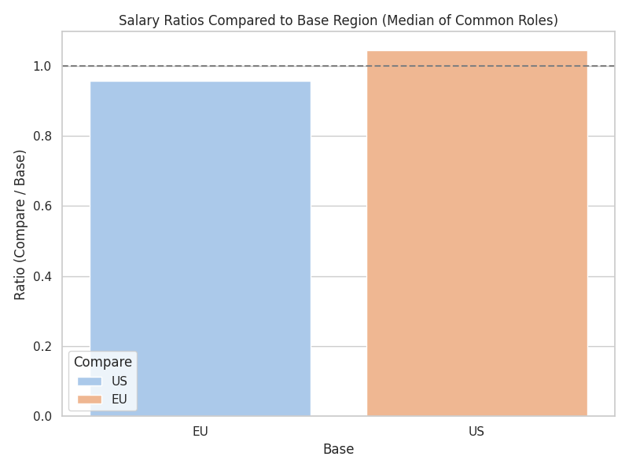
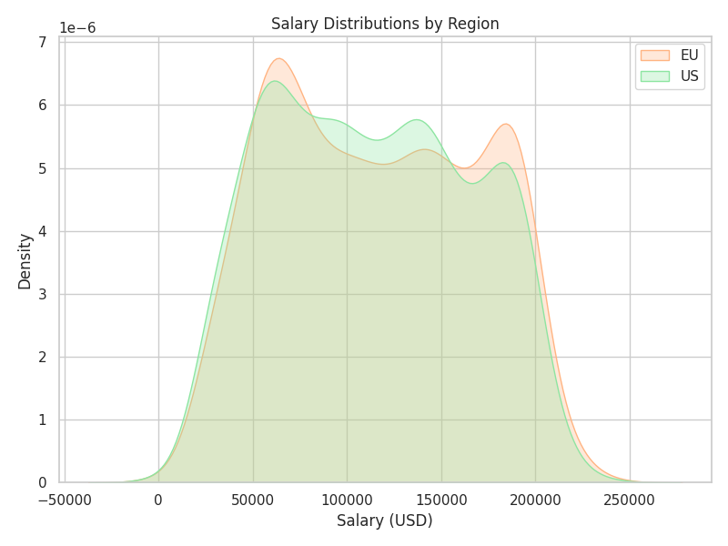
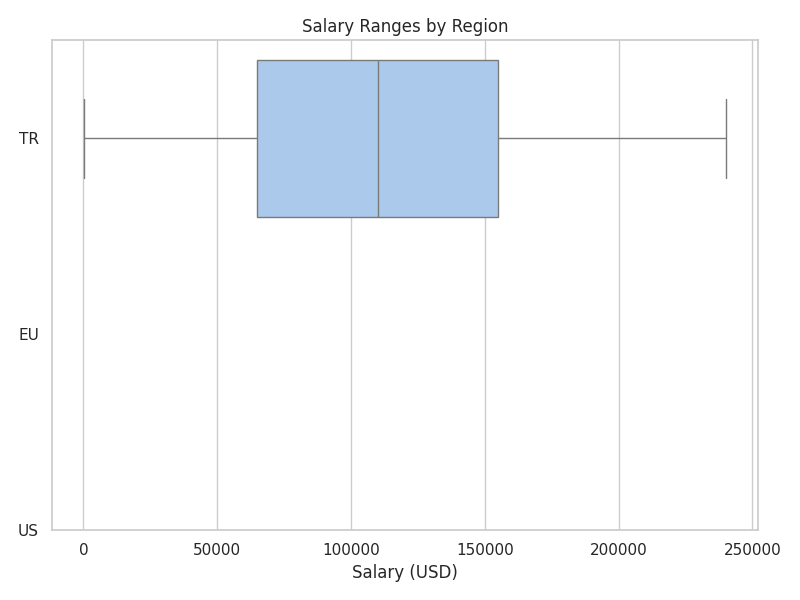
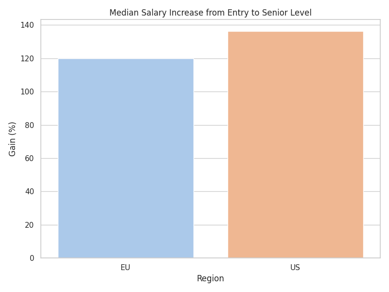

# Comparative Salary & Welfare Analysis Report (TR vs EU vs US)
Generated automatically by salary_analysis.py

## Executive Summary
Key salary disparities observed include:
* **EU** salaries are **1.05×** those in **US** for common roles.
* **US** salaries are **0.96×** those in **EU** for common roles.

* Income inequality (Gini) in **TR** is **0.00**.
* Income inequality (Gini) in **EU** is **0.26**.
* Income inequality (Gini) in **US** is **0.26**.

## Methodology
Data from two sources were merged, converted, and normalised. See the Python script for detailed steps.

## Detailed Findings
### Salary Ratios
| Base   | Compare   |   MedianSalaryBase |   MedianSalaryCompare |    Ratio |
|:-------|:----------|-------------------:|----------------------:|---------:|
| EU     | US        |             115000 |                110000 | 0.956522 |
| US     | EU        |             110000 |                115000 | 1.04545  |

### Income Percentiles
|    |    25th |   50th (Median) |     75th |     90th |
|:---|--------:|----------------:|---------:|---------:|
| TR |  3049.2 |          3049.2 |   3049.2 |   3049.2 |
| EU | 70000   |        115000   | 160000   | 190000   |
| US | 65000   |        110000   | 155000   | 185000   |

### Career Gain (Entry → Senior)
| Region   |   GainPercent |
|:---------|--------------:|
| EU       |       120     |
| US       |       136.364 |

## Visuals

